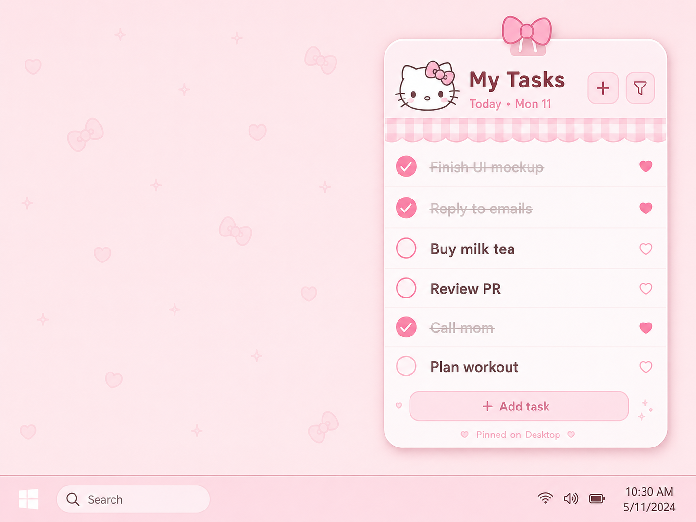

  

<h1 align="center">我的任务</h1>

  一个可爱、轻量、常驻桌面的中文待办小组件。打开就能看到今天要做什么，点一下就完成。

  
  
  

## 下载

到 [Releases](https://github.com/Neroxsh/hello-kitty-todo/releases/latest) 下载最新版：

| 系统 | 下载哪个文件 |
| --- | --- |
| macOS | `HelloKittyTodo_0.1.2_macOS_arm64.dmg` |
| Windows | `HelloKittyTodo_0.1.2_Windows_x64_Setup.exe` |

> macOS 版本暂未签名。第一次打开时，如果系统拦截，可以右键应用选择“打开”，或到系统设置里允许打开。

## 这是什么

`我的任务` 是一个放在桌面角落的小待办。它不是复杂的任务管理器，更像一张一直陪在旁边的粉色便签：

- 记录今天要做什么
- 点一下圆圈完成任务
- 用爱心标记重要任务
- 只在需要时展开添加输入框
- 窗口可以常驻、隐藏到托盘、随手拖到喜欢的位置

## 功能

- 今日任务列表
- 完成 / 取消完成
- 收藏任务
- 删除任务
- 筛选全部、未完成、已完成、收藏
- 本地保存任务和偏好
- 无边框透明圆角窗口
- macOS / Windows 托盘菜单
- 默认置顶，可切换固定状态

## 使用

1. 下载适合你系统的安装包。
2. 打开应用。
3. 点击右上角 `+` 添加任务。
4. 点击左侧圆圈完成任务。
5. 点击右侧爱心收藏任务。
6. 不想显示窗口时，可以从托盘菜单隐藏或重新打开。

## License

MIT
